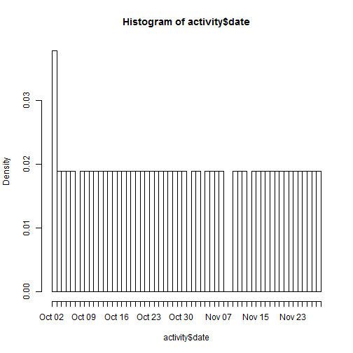

# Reproducible Research: Peer Assessment 1


## Loading and preprocessing the data


## What is mean total number of steps taken per day?


```r

tapply(activity$steps, activity$date, mean, na.rm = TRUE)
```

```
## 2012-10-02 2012-10-03 2012-10-04 2012-10-05 2012-10-06 2012-10-07 
##     0.4375    39.4167    42.0694    46.1597    53.5417    38.2465 
## 2012-10-09 2012-10-10 2012-10-11 2012-10-12 2012-10-13 2012-10-14 
##    44.4826    34.3750    35.7778    60.3542    43.1458    52.4236 
## 2012-10-15 2012-10-16 2012-10-17 2012-10-18 2012-10-19 2012-10-20 
##    35.2049    52.3750    46.7083    34.9167    41.0729    36.0938 
## 2012-10-21 2012-10-22 2012-10-23 2012-10-24 2012-10-25 2012-10-26 
##    30.6285    46.7361    30.9653    29.0104     8.6528    23.5347 
## 2012-10-27 2012-10-28 2012-10-29 2012-10-30 2012-10-31 2012-11-02 
##    35.1354    39.7847    17.4236    34.0938    53.5208    36.8056 
## 2012-11-03 2012-11-05 2012-11-06 2012-11-07 2012-11-08 2012-11-11 
##    36.7049    36.2465    28.9375    44.7326    11.1771    43.7778 
## 2012-11-12 2012-11-13 2012-11-15 2012-11-16 2012-11-17 2012-11-18 
##    37.3785    25.4722     0.1424    18.8924    49.7882    52.4653 
## 2012-11-19 2012-11-20 2012-11-21 2012-11-22 2012-11-23 2012-11-24 
##    30.6979    15.5278    44.3993    70.9271    73.5903    50.2708 
## 2012-11-25 2012-11-26 2012-11-27 2012-11-28 2012-11-29 
##    41.0903    38.7569    47.3819    35.3576    24.4688
```

```r

tapply(activity$steps, activity$date, FUN = median)
```

```
## 2012-10-02 2012-10-03 2012-10-04 2012-10-05 2012-10-06 2012-10-07 
##          0          0          0          0          0          0 
## 2012-10-09 2012-10-10 2012-10-11 2012-10-12 2012-10-13 2012-10-14 
##          0          0          0          0          0          0 
## 2012-10-15 2012-10-16 2012-10-17 2012-10-18 2012-10-19 2012-10-20 
##          0          0          0          0          0          0 
## 2012-10-21 2012-10-22 2012-10-23 2012-10-24 2012-10-25 2012-10-26 
##          0          0          0          0          0          0 
## 2012-10-27 2012-10-28 2012-10-29 2012-10-30 2012-10-31 2012-11-02 
##          0          0          0          0          0          0 
## 2012-11-03 2012-11-05 2012-11-06 2012-11-07 2012-11-08 2012-11-11 
##          0          0          0          0          0          0 
## 2012-11-12 2012-11-13 2012-11-15 2012-11-16 2012-11-17 2012-11-18 
##          0          0          0          0          0          0 
## 2012-11-19 2012-11-20 2012-11-21 2012-11-22 2012-11-23 2012-11-24 
##          0          0          0          0          0          0 
## 2012-11-25 2012-11-26 2012-11-27 2012-11-28 2012-11-29 
##          0          0          0          0          0
```


## What is the average daily activity pattern?

```r

hist(activity$date, activity$steps, breaks = 60)
```

 


## Imputing missing values


## Are there differences in activity patterns between weekdays and weekends?
